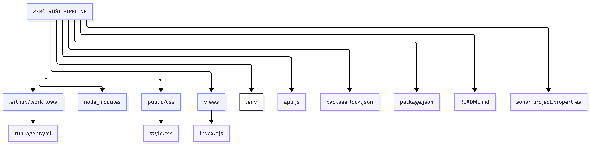

# 🛡️ DevSecOps Pipeline: Zero-Trust Architecture

[](https://github.com/andresafag/zerotrust_pipeline/actions)
[](https://sonarcloud.io/dashboard?id=andresafag_zerotrust_pipeline)
[](https://snyk.io/test/github/andresafag/zerotrust_pipeline)
[](https://opensource.org/licenses/MIT)

This project demonstrates a basic **Zero-Trust DevSecOps Pipeline**. Our philosophy is simple: **Security is not an extra step; it is part of the code.** Every commit is treated as untrusted until proven secure through automated validation.

---

## 🧠 Core Concepts

*   **DevSecOps:** Shifting security to the left by embedding it into the CI/CD lifecycle.
*   **Supply Chain Security:** Protecting every dependency and container layer.
*   **Policy-as-Code (PaC):** Using automated rules to enforce compliance and security standards.

---

## 🏗️ Pipeline Architecture

The pipeline, built on **GitHub Actions**, follows a strict Zero-Trust flow:

### 🔍 1. Static Analysis (SAST)
*   **Tool:** [SonarCloud](https://sonarcloud.io/)
*   **Action:** Deep-scans source code for vulnerabilities, bugs, and "code smells" before any build occurs.

### 📦 2. Software Composition Analysis (SCA)
*   **Tool:** [Snyk](https://app.snyk.io/)
*   **Action:** Identifies vulnerabilities in third-party libraries and scans Docker container layers for known CVEs.

### 🔐 3. Secret Management
*   **Tool:** [HashiCorp Vault](https://www.vaultproject.io/)
*   **Action:** Eliminates hardcoded credentials. Secrets are injected dynamically at runtime using short-lived tokens.

---

## 🛠️ Tech Stack

| Layer | Technology |
| :--- | :--- |
| **CI/CD Orchestration** | GitHub Actions |
| **Static Code Analysis** | SonarCloud |
| **Dependency & Container Scan** | Snyk |
| **Secrets Engine** | HashiCorp Vault |

---


1.  Configure secrets (GitHub repo Settings → Secrets):
    - VAULT_ADDR
    - VAULT_TOKEN
    - SNYK_TOKEN (if using Snyk in CI)
    - SONAR_TOKEN (for SonarCloud analysis)
  
  

  

2.  Run local checks (examples — adapt if scripts differ):
    ```bash
    # unit tests
    ./scripts/test.sh || make test

    # local SAST (if sonar-scanner installed)
    sonar-scanner -Dsonar.projectKey=andresafag_zerotrust_pipeline

    # local SCA with Snyk (if installed)
    snyk test
    ```
3.  Push to main to run full GitHub Actions pipeline:
    ```bash
    git add . && git commit -m "ci: run pipeline" && git push origin main
    ```

---

## 🔁 CI / Pipeline details

- Workflow path: .github/workflows/run_agent.yml
- Main jobs:
  - build: build artifacts and container images
  - sast: run SonarCloud analysis (quality gate blocks merge)
  - sca: run Snyk dependency/container scans
  - secrets-check: detect hardcoded secrets and policy violations
  - deploy (optional): gated by passing security checks
- Failure criteria: Sonar quality gate fail, configured CVE severity threshold exceeded, or detection of secrets triggers pipeline failure (configurable in workflow).

---

## 🗂️ Key files & structure

- .github/workflows/run_agent.yml — main pipeline definition
- sonar-project.properties — SonarCloud configuration
- scripts/ — helper scripts for local checks and CI
- docs/ — architecture diagrams and policy docs
- .github/README.md — contributor CI guidance (if present)

---

## 🧭 Architecture (quick view)

Repository → GitHub Actions (build → SAST → SCA → secrets validation) → SonarCloud / Snyk dashboards → Vault for secrets injection



---

## 🙋 Contribution & Contact

- Open issues and PRs; include failing workflow logs in PR description.
- Maintainer: Andrés Acosta García — https://github.com/andresafag

---

## 🛡️ "Security is a process, not a product."

Built with ❤️ by Andrés Acosta García

